# 13 — End-to-end datastroom (gereconstrueerd uit code)

Deze reconstructie is uitsluitend gebaseerd op code die daadwerkelijk gelezen is in [10-OFFERTEAPP-DEEP-DIVE.md](10-OFFERTEAPP-DEEP-DIVE.md) en [11-QUOTE-APP-DEEP-DIVE.md](11-QUOTE-APP-DEEP-DIVE.md). Geen enkele stap hieronder is aangenomen.

## De belangrijkste bevinding, vooraf

De opdracht veronderstelde een keten `Website → s4u-quote-app → ? → OfferteApp → Shopify → transport/warehouse/betaling`. De werkelijkheid is dat **stap "?" leeg is — er bestaat geen enkele geautomatiseerde koppeling tussen s4u-quote-app en OfferteApp.** Beide apps bevestigen dit onafhankelijk van elkaar, vanuit hun eigen code én eigen documentatie (zie §21 in beide deep-dive-rapporten). Het zijn **twee volledig gescheiden offerte-systemen** die toevallig hetzelfde Shopify-store delen.

## Diagram: werkelijke huidige staat

```mermaid
flowchart TD
    subgraph SF["Storefront (website)"]
        A[Klant vraagt offerte aan\nvia Theme App Extension]
    end

    subgraph SQA["s4u-quote-app — Fly: s4u-quote-app"]
        B[App Proxy /apps/quote/submit\nHMAC + CSRF + rate limit]
        C[(Postgres: Quote, QuoteItem\n— system of record voor\ndeze offerte-aanvraag)]
        D[Merchant-notificatiemail\nnodemailer, alleen naar winkelier]
        E{Winkelier klikt\nhandmatig 'Maak Draft Order'\nin s4u-quote-app admin-UI}
    end

    A -->|POST, prijzen server-side hervalideerd| B --> C
    B -.->|fire-and-forget| D
    C --> E
    E -->|draftOrderCreate| SHOP1[(Shopify Draft Order\ntag: quote:QR-...)]

    subgraph GAP["ONTBREKENDE KOPPELING"]
        X["Geen webhook, geen gedeelde database,\ngeen API-call, geen geautomatiseerde export.\nBevestigd in de eigen docs van BEIDE apps."]
    end

    SHOP1 -.->|geen enkel automatisch\nleesmechanisme gevonden| GAP
    D -.->|geen enkel automatisch\nleesmechanisme gevonden| GAP

    subgraph OA["OfferteApp — Fly: offerteapp — system of record voor offerte-verwerking"]
        F[Medewerker bouwt offerte\nhandmatig in bezoekrapport-UI\nzoekt live in Shopify producten/klanten]
        G[(Postgres: Quote, QuoteLine,\nQuoteVersion, CustomerCache)]
        H{draftOrderCreate}
        I[Verzendt factuur/betaallink\nShopify invoice OF Mollie]
        J{draftOrderComplete}
    end

    GAP -. "zou hier moeten binnenkomen,\ngebeurt vandaag niet" .-> F
    F --> G --> H --> SHOP2[(Shopify Draft Order\n— OfferteApp's eigen)]
    SHOP2 --> I

    subgraph PAY["Betaling"]
        P1[Shopify Checkout\nklant betaalt zelf de factuurlink]
        P2[Mollie Payment Link\nwebhook POST /api/payment/mollie/webhook\nherbevestigt status live bij Mollie]
        P3["'Op rekening' — handmatig\ngeen automatische bevestiging"]
    end

    I --> P1 & P2 & P3
    P1 --> J
    P2 -->|bij status=paid: auto-complete| J
    P3 -.->|order editing API gebouwd,\nnog niet aan UI gekoppeld| J

    J --> SHOP3[(Shopify Order\n— system of record voor de order zelf)]

    subgraph OPS["Operations — na order-plaatsing"]
        W1["Pallet Yard (warehouse)\nPOST /api/fulfillment/plans\nINBOUND: POST /api/warehouse/callback\n— status terug in WarehouseFulfillmentLink"]
        T1["Transport-S4U / Van Eijk\nbearer-token API, TransportJob-model\nvolledige levenscyclus + labels"]
        T2["Hoefnagels-transport\nGEEN TransportJob — alleen\nQuote.hoefnagels_* velden +\norder-metafield + planning per e-mail"]
        PR["Pikbon/pakbon/labels\nzelfde PDF-engine als offerte-mail\nlokale Print Agent op localhost:9876"]
    end

    SHOP3 --> W1
    SHOP3 --> T1
    SHOP3 --> T2
    SHOP3 --> PR

    subgraph POS["Kassa Systeem (POS) — apart, geen aantoonbare koppeling"]
        K["Toonbankverkoop\neigen Cart/Payment/Receipt\nCCV-pinbetaling"]
        L{draftOrderCreate/Complete}
    end

    K --> L --> SHOP4[(Shopify Order\n— POS' eigen, ongerelateerd\naan offerte-orders)]

    style GAP fill:#4a1a1a,stroke:#c0392b,stroke-width:2px
```

## Stap-voor-stap, met system-of-record

| Stap | Applicatie | System-of-record voor dit gegeven | Bewijs |
|---|---|---|---|
| Offerteaanvraag ingediend op de website | s4u-quote-app | **s4u-quote-app's eigen Postgres** (`Quote`/`QuoteItem`) | `app/routes/apps.quote.submit.tsx` |
| Klantgegevens bij aanvraag | s4u-quote-app | Alleen op de `Quote`-rij zelf, **niet gesynchroniseerd naar Shopify Customer** | `read_customers`-scope aangevraagd maar ongebruikt |
| Prijzen bij aanvraag | Shopify (live herbevestigd) | Shopify's live variant-prijs is bron van waarheid, client-prijs alleen ter vergelijking gelogd | `validate-items.server.ts` |
| Notificatie van nieuwe aanvraag | s4u-quote-app → e-mail | Eenmalig, niet-structureel, alleen naar de winkelier | `notification.server.ts` |
| **Overdracht naar OfferteApp** | **— bestaat niet —** | — | Bevestigd afwezig in beide codebases + beide apps' eigen documentatie |
| Draft order vanuit s4u-quote-app (indien de winkelier daar handmatig op klikt) | s4u-quote-app | Shopify Draft Order, getagd `quote:{nummer}` | `draft-order.server.ts` |
| Offerte in OfferteApp | OfferteApp | **OfferteApp's eigen Postgres** (`Quote`/`QuoteLine`/`QuoteVersion`) — **volledig los aangemaakt door een medewerker**, niet afgeleid van de s4u-quote-app-aanvraag | `quote_service.py`, bevestigd handmatige-intake-only in §21 |
| Klantgegevens in OfferteApp | Shopify (met lokale cache) | `CustomerCache` is een snelheids-cache, Shopify blijft bron van waarheid | `customer_cache_service.py` |
| Draft order vanuit OfferteApp | OfferteApp | Shopify Draft Order (apart object van een eventuele s4u-quote-app-draft-order over "dezelfde" klant) | `draft_order_service.py` |
| Betaling | Shopify **of** Mollie | Shopify's betaalstatus, of `MolliePayment`-model + webhook (Mollie's API blijft altijd de bron van waarheid, nooit de webhook-payload zelf) | `mollie_client.py`, webhook-handler |
| Order (na completion) | **Shopify** | De Shopify Order zelf is vanaf hier het centrale, gedeelde object — gelezen door OfferteApp, Pallet Yard, Transport-S4U via custom metafields en de order-ID | `order_service.py` |
| Warehouse/fulfillment-planning | Pallet Yard (apart systeem) | `WarehouseFulfillmentLink` in OfferteApp volgt alleen de koppel-status; Pallet Yard's eigen database is bron van waarheid voor het plan zelf | `warehouse_service.py`, inbound callback bevestigd |
| Transport (Van Eijk) | Transport-S4U (apart systeem) | `TransportJob`/`TransportEvent` in OfferteApp is een lokale spiegel; Transport-S4U's eigen systeem is bron van waarheid voor de zending zelf | `transport_integration/` |
| Transport (Hoefnagels) | OfferteApp zelf | Geen extern systeem — alleen `Quote.hoefnagels_*`-velden + e-mailplanning | Bevestigd: geen `TransportJob`-rij voor dit pad |
| Pikbon/pakbon/labels | OfferteApp + lokale Print Agent (buiten deze repo) | Print-tellers op Shopify order-metafields | `offerte/api.py`, `print-agent.js` |
| Toonbankverkoop (POS) | Kassa Systeem | Volledig eigen Cart/Payment/Receipt-model, resulteert in een eigen Shopify Order — **geen aantoonbare koppeling met OfferteApp-offertes of Draft Orders** gevonden in beide codebases | Eerdere POS-discovery + deze pas |

## Wat dit betekent

1. **Er zijn vandaag effectief twee parallelle, ongekoppelde offerte-systemen** (s4u-quote-app voor storefront-aanvragen, OfferteApp voor door medewerkers gebouwde offertes), die beide onafhankelijk Shopify Draft Orders kunnen aanmaken op naam van "dezelfde" klant, zonder dat het ene systeem weet van het andere.
2. **Shopify Order is het enige punt waar de systemen (kunnen) samenkomen** — via custom metafields (`status_bestelling`, `gewenste_leverdatum`, printtellers) die alleen OfferteApp leest/schrijft.
3. **POS staat volledig los** van beide offerte-systemen — het heeft zijn eigen Shopify Order-stroom via de kassa.
4. Dit diagram is de belangrijkste input voor [16-PLATFORM-BOUNDARIES.md](16-PLATFORM-BOUNDARIES.md) en [18-RECOMMENDED-BUILD-SEQUENCE.md](18-RECOMMENDED-BUILD-SEQUENCE.md): een CRM dat "offertes" wil tonen, moet vanaf dag één weten dat er **twee bronnen** zijn, niet één.
